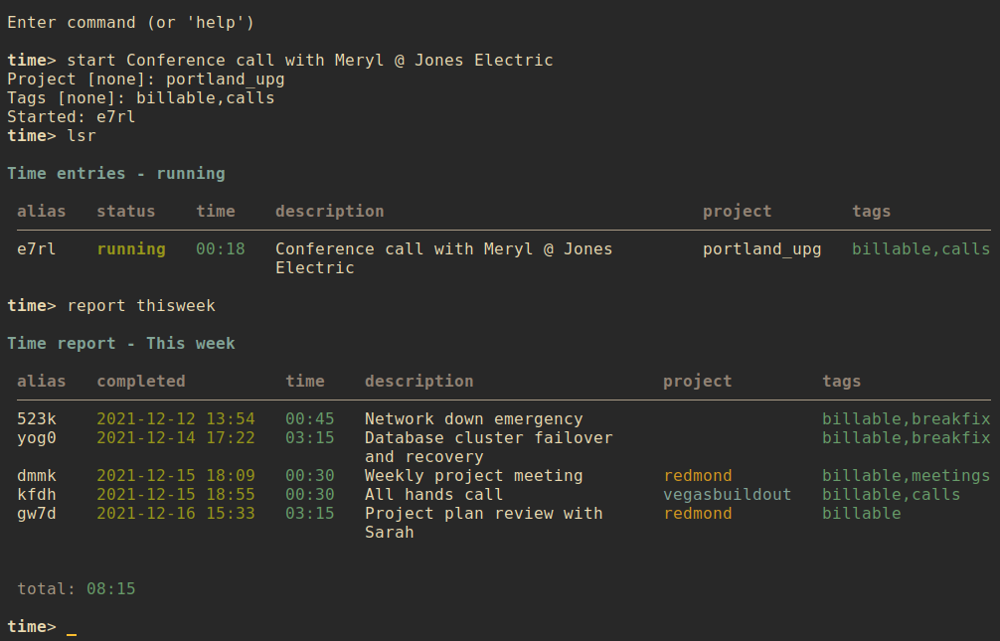

# nrrdtime

A terminal-based time tracking program with advanced search options, formatted output, and time entry data stored in local text files.

## Contents

- [Getting nrrdtime](#getting-nrrdtime)
    - [Downloading](#downloading)
    - [Python dependencies](#python-dependencies)
    - [Installing](#installing)
        - [Setuptools](#setuptools)
        - [Make](#make)
- [Using nrrdtime](#using-nrrdtime)
    - [Basic usage](#basic-usage)
    - [Command-line usage](#command-line-usage)
        - [Starting a new time entry](#starting-a-new-time-entry)
        - [Listing time entries](#listing-time-entries)
        - [Viewing a time entry](#viewing-a-time-entry)
        - [Assigning a time entry to a project](#assigning-a-time-entry-to-a-project)
        - [Tagging a time entry](#tagging-a-time-entry)
        - [Pausing and resuming](#pausing-and-resuming)
        - [Stopping a time entry](#stopping-a-time-entry)
        - [Modifying a time entry](#modifying-a-time-entry)
        - [Clearing values from a time entry](#clearing-values-from-a-time-entry)
        - [Adding and editing notes](#adding-and-editing-notes)
        - [Deleting a time entry](#deleting-a-time-entry)
        - [Editing a time entry](#editing-a-time-entry)
        - [Report and query](#report-and-query)
        - [Exclusion](#exclusion)
        - [Report examples](#report-examples)
        - [Query and limit](#query-and-limit)
        - [Paging](#paging)
    - [Interactive shell](#interactive-shell)
        - [Interactive modify](#interactive-modify)
        - [A note about refresh](#a-note-about-refresh)
    - [Configuration](#configuration)
        - [Default configuration](#default-configuration)
        - [Alternate configuration](#alternate-configuration)
        - [Editing configuration](#editing-configuration)
        - [Main configuration options](#main-configuration-options)
            - [About time rounding](#about-time-rounding)
        - [Color configuration options](#color-configuration-options)
    - [Time entry data](#time-entry-data)
        - [Time entry data fields](#time-entry-data-fields)
            - [Managed fields](#managed-fields)
            - [User-modified fields](#user-modified-fields)
    - [FAQ](#faq)

## Getting `nrrdtime`
### Downloading
To download `nrrdtime` simply clone this repository:

    git clone https://github.com/sdoconnell/nrrdtime.git

### Python dependencies
`nrrdtime` requires Python 3.8+ and the following Python 3 libraries to be available:

- `tzlocal`
- `dateutil`
- `pyyaml`
- `rich`
- `watchdog`

You may install these dependencies from your Linux distribution's repos (if available) or via `pip` using the `requirements.txt` file provided in this repository:

    pip install -r requirements.txt

### Installing
You may install the application one of two ways: via `setuptools`, or via `make`. Installing via `make` will also install the manpage for `nrrdtime(1)` and will copy the `README.md` file into your system documentation directory.

#### Setuptools
Run the `setup.py` script to install system-wide (likely requires `su` or `sudo`):

    sudo python3 setup.py install

Alternatively, you may install the package to your `$HOME` directory.

    python3 setup.py install --user

#### Make
Use `make` to install the application system-wide (likely requires `su` or `sudo`):

    sudo make install

There is also an `uninstall` operation available:

    sudo make uninstall

## Using `nrrdtime`
### Basic usage
`nrrdtime` is a terminal-based application that can be run in either of two modes: command-line or interactive shell.

    usage: nrrdtime [-h] [-c <file>] for more help: nrrdtime <command> -h ...

    Terminal-based time tracking for nerds.

    commands:
      (for more help: nrrdtime <command> -h)
        config              edit configuration file
        delete (rm)         delete an entry file
        edit                edit a time entry file (uses $EDITOR)
        info                show info about a time entry
        list (ls)           list running and/or paused entries
        modify (mod)        modify a time entry
        notes               add/update notes on a time entry (uses $EDITOR)
        pause               pause the clock on an entry
        query               search time entries with structured text output
        report (rp)         print a time report
        resume              resume the clock on an entry
        shell               interactive shell
        start               create a new time entry
        stop                stop the clock on an entry
        unset               clear a field from a specified time entry
        version             show version info

    optional arguments:
      -h, --help            show this help message and exit
      -c <file>, --config <file>
                            config file

### Command-line usage
#### Starting a new time entry
Use the `start` subcommand and provide an entry description to start tracking time. This option will create a new entry file in your `nrrdtime` data directory (`$XDG_DATA_HOME/nrrdtime` or `$HOME/.local/share/nrrdtime` by default). See `nrrdtime start -h` for all available options and their command syntax.

    nrrdtime start <description> [options]

#### Listing time entries
There are three options for listing your active time entries:

1. `list all` (or `lsa`) : list all time entries, running and paused.
2. `list paused` (or `lsp`) : list all time entries in the `paused` state.
3. `list running` (or `lsr`) : list all time entries in the `running` state.

#### Viewing a time entry
You may view all available details about a time entry by using the `info` command and supplying the entry's `alias`. For example:

    nrrdtime info 5kzb

#### Assigning a time entry to a project
When creating a new entry with `start` or using `modify` to update an entry, you may set the project for the entry with the `--project` option. Time reports and queries can use project names to filter results.

    nrrdtime modify 3er5 --project jones_electric

**NOTE**: project names are case-insensitive and are presented in lowercase. You should not use spaces in project names.

#### Tagging a time entry
When creating a new entry with `start` or using `modify` to update an entry, you may apply tags to the entry with the `--tags` option. Time reports and queries can use tags to filter results.

    nrrdtime modify 3er5 --tags testing,development

#### Pausing and resuming
A `running` time entry may be paused with the `pause` command to stop the clock on a tracked activity.

    nrrdtime pause 3er5

You may then restart the clock on a `paused` time entry by using the `resume` command.

    nrrdtime resume 3er5

#### Stopping a time entry
A `running` time entry may be stopped with the `stop` command. A stopped time entry is considered a "completed" activity and the clock may not be re-started.

    nrrdtime stop 3er5

#### Modifying a time entry
Time entry data may be changed using the `modify` command. See `nrrdtime modify -h` for all available options and their command syntax.

    nrrdtime modify <alias> [options]

#### Clearing values from a time entry
The following fields of a time entry can be cleared (set to `null`) using the `unset` command:
- `tags`
- `project`

The command syntax is:

    nrrdtime unset <alias> <field>

#### Adding and editing notes
To add or edit notes attached to a time entry, use the `notes` command:

    nrrdtime notes <alias>

Notes for the time entry will be opened in the user's preferred editor (defined by `$EDITOR`). When the editor exits, the updated notes will be written to the entry file. This is the safest mode of adding notes to an entry file, as `nrrdtime` will handle the necessary quoting/escaping to ensure proper YAML is written to the file.

#### Deleting a time entry
Use the `delete` subcommand to delete a time entry identified by the record's `alias`. Confirmation will be required for this operation unless the `--force` option is also used.

    nrrdtime delete <alias> [--force]

#### Editing a time entry
Use the `edit` subcommand to open the time entry file in your preferred editor. Use care in editing the entry file directly. Malformed file structure may result in `nrrdtime` being unable to properly parse the file.

#### Report and query
There are two command-line methods for filtering the presented list of time entries: `report` and `query`.

`report` produces a time report in a tabular, human-readable format. Query results are presented in the form of tab-delimited text (by default) or JSON (if using the `-j` or `--json` option) and are primarily intended for use by other programs that are able to consume structured text output.

`report` and `query` use the same filter syntax. The most basic form of filtering is to simply search for a keyword or string in the time entry description:

    nrrdtime report <search_term>

**NOTE:** search terms are case-insensitive.

If the search term is present in the time entry `description`, the time entry will be displayed.

Optionally, a search type may be specified. The search type may be one of `uid`, `alias`, `description`, `project`, `tags`, `status`, `started`, `completed`, or `notes`. If an invalid search type is provided, the search type will default to `description`. To specify a search type, use the format:

    nrrdtime report [search_type=]<search_term>

You may combine search types in a comma-delimited structure. All search criteria must be met to return a result.

The tags search type may also use the optional `+` operator to search for more than one tag. Any matched tag will return a result.

The special search term `any` can be used to match all time entries, but is only useful in combination with an exclusion to match all records except those excluded.

#### Exclusion
In addition to the search term, an exclusion term may be provided. Any match in the exclusion term will negate a match in the search term. An exclusion term is formatted in the same manner as the search term, must follow the search term, and must be denoted using the `%` operator:

    nrrdtime report [search_type=]<search_term>%[exclusion_type=]<exclusion_term>

#### Report examples
Search for any time entry description with the word "projectx":

    nrrdtime report projectx

Search for any time entries completed 2021-11-15:

    nrrdtime report completed=2021-11-15

Search for all time entries tagged "development" or "testing" with a status of "stopped", except for those that are tagged "nonbill":

    nrrdtime report status=stopped,tags=development+testing%tags=nonbill

#### Query and limit
The `query` function uses the same syntax as `report` but will output information in a form that may be read by other programs. The standard fields returned by query for tab-delimited output are:

    - `uid` (string)
    - `alias` (string)
    - `status` (string)
    - `started` (string)
    - `completed` (string)
    - `time` (string)
    - `description` (string)
    - `project` (string)
    - `tags` (list)

List fields are returned in standard Python format: ['item 1', 'item 2', ...]. Empty lists are returned as []. Empty string fields will appear as multiple tabs.

JSON output returns all fields for a record, including fields not provided in tab-delimited output.

The query function may also use the `--limit` (`-l`) option. This is a comma-separated list of fields to return. The `--limit` option does not have an effect on JSON output.

#### Paging
Output from `list`, `report`, and `info` can get long and run past your terminal buffer. You may use the `-p` or `--page` option in conjunction with `report`, `list`, or `info` to page output.

### Interactive shell
`nrrdtime` also features an interactive mode, enabled by `shell`. This mode offers commands similar to the command-line options, but in a persistent shell-like environment.

Most commands are similar to their command-line argument analogs:

- `list <view>` (or `lsa`, `lsp`, `lsr`)
- `config`
- `info <alias>`
- `edit <alias>`
- `modify <alias>`
- `notes <alias>`
- `pause <alias>`
- `delete <alias>` (or `rm <alias>`), confirmation is always required (no `--force`).
- `report <term>`
- `resume <alias>`
- `start <alias>`
- `stop <alias>`
- `help [command]`

**NOTE**: `query` does not have a shell command, as there is no obvious use case for that command in interactive mode.

A couple of additional shell-specific commands exist:
- `clear` : clear the shell output.
- `refresh` : re-read the time entry files on disk if edits were made outside of `nrrdtime`.

#### Interactive modify
To modify a time entry in interactive mode, use the command `modify <alias>` to enter a subshell for modifying the record. When done making changes, you may leave the subshell with the command `done`. For available commands, use the `help` command while in the modify subshell. The syntax is similar to that for the CLI modify command, with the exception that it is not necessary to specify an alias with the subcommands (due to the subshell context being a specific time entry). For example:

CLI usage:

    nrrdtime modify aw4d --tags +development,testing

Interactive usage:

    time> modify aw4d
    modify (aw4d)> tags +development,testing
    modify (aw4d)> done
    time>

All changes made while in the `modify` subshell take effect (and are saved) immediately.

#### A note about `refresh`
When using `modify`, `edit`, or `delete` it is **not** necessary to perform a manual `refresh` afterward. This is done automatically when the previous operation is completed. In general, a manual `refresh` should not be needed but the functionality is included to cover edge cases.
 

### Configuration
#### Default configuration
By default, `nrrdtime` reads its configuration from a config file located at either `$XDG_CONFIG_HOME/nrrdtime/config` or `$HOME/.config/nrrdtime/config`. If the default configuration file does not exist, `nrrdtime` will attempt to create the file with default options specified.

#### Alternate configuration
Instead of the default configuration file, an alternate config file may be selected by using the command-line argument `-c <file>`.

#### Editing configuration
For convenience, the `config` command will open the config file in your `$EDITOR`. In interactive shell mode, the configuration will be reloaded after editing and the new settings applied immediately.

#### Main configuration options
The following options are available under the `[main]` header of the configuration file:

- `data_dir` : (str) the location of time entry files.
- `first_weekday` : (int) the first day of the week (0 = Mon, 6 = Sun, default: 6).
- `rounding_method` : (int) round time up (1), down (2) or don't round time (empty) (default: empty).
- `rounding_interval` : (int) round time up or down (per `rounding_method`) to 15m (1), 30m (2), or 1h (3) (default: 1).
- `show_seconds` : (bool) show seconds in time entries and timestamps (default: false).

##### About time rounding
The `rounding_method` chosen determines the way time is *displayed*. Time is always captured as a real datetime. If rounding is enabled, the display of `info` will show both the real time and the rounded time for an entry (displayed as: `real (rounded)`, but a time report will only include rounded time. Use caution choosing your `rounding_method` and `rounding_interval` to ensure you get output that is sensible for your purposes. For example, rounding down (method 2) with a rounding interval of 1 hour (interval 3) will cause any time entry that is less than 60 minutes in duration to show a rounded time of `00:00`. Maybe that's what you want? But probably not.

#### Color configuration options
`nrrdtime` supports customization of colors and bold in output. The following options are available under the `[colors]` header of the configuration file:

- `disable_colors` : (bool) turn off color output.
- `disable_bold` : (bool) turn off bold font output.
- `color_pager` : (bool) turn on or off color output in the pager (disabled by default, enable if your pager supports color output).

The following options under the `[colors]` header can be used to define a custom color scheme. Specify one of the standard terminal color names such as `red`, `black`, `bright_yellow`, etc.

- `title` : (str) the color for the table title.
- `header` : (str) the color of the table header row.
- `description` : (str) the color for entry description text.
- `alias` : (str) the color for alias text.
- `tags` : (str) the color for tags text.
- `label` : (str) the color for field labels.
- `date` : (str) the default color for dates.
- `time` : (str) the color for time text.
- `status_stopped` : (str) the color for 'stopped' status.
- `status_running` : (str) the color for 'running' status.
- `status_paused` : (str) the color for 'paused' status.
- `border` : (str) the default color for table borders and lines.

To use custom colors for specific project names in time entry lists and info output, you may add entries under the `[project_colors]` header of the config file in the form `<project name> = <color>`.

### Time entry data
Time entry files are stored the `data_dir` defined by the `nrrdtime` configuration file. The default location is `$XDG_DATA_HOME/nrrdtime` or `$HOME/.local/share/nrrdtime`. Each time entry is stored in its own text file and is serialized in [YAML](https://yaml.org/) format. For more information about editing YAML files, see the [YAML spec](https://yaml.org/spec/1.2/spec.html).

#### Time entry data fields
In theory, any arbitrary data may be stored in time entry files. However, `nrrdtime` will only parse and display the below data set.

##### Managed fields
The following fields are managed by `nrrdtime` and should not be edited directly.

- `uid` : an [RFC 4122](https://datatracker.ietf.org/doc/html/rfc4122) UUID, randomly generated when the record is created via `start`.
- `created` : Datetime timestamp. Generated when the record is created via `start`.
- `updated` : Datetime timestamp. Generated when the record is created via `start` and updated when the record is edited via `modify`.
- `alias` : A randomly-generated 4-digit alias for the entry.
- `stopwatch` : A dictionary of start and stop times, managed by `nrrdtime` when an entry is started, paused, resumed, or stopped.

##### User-modified fields
The following fields may be modified by the user.

- `tags` : Tags assigned to the time entry. (list)
- `description` : The description for the time entry.
- `started` : The entry started date/time (datetime). This field is usually managed by `nrrdtime` but can be modified.
- `completed` : The entry completed date/time (datetime). This field is usually managed by `nrrdtime` but can be modified.
- `status` : The time entry status. This field is usually managed by `nrrdtime` but can be modified.
- `project` : The project to which the time entry is associated.
- `notes` : Notes attached to the time entry.

The `notes` field is freeform, but must be properly quoted/escaped. For example, `:` and `#` characters should usually be escaped with `\` to ensure the field is parsed correctly. For more information about multiline strings in YAML, see [this site](https://yaml-multiline.info/).

